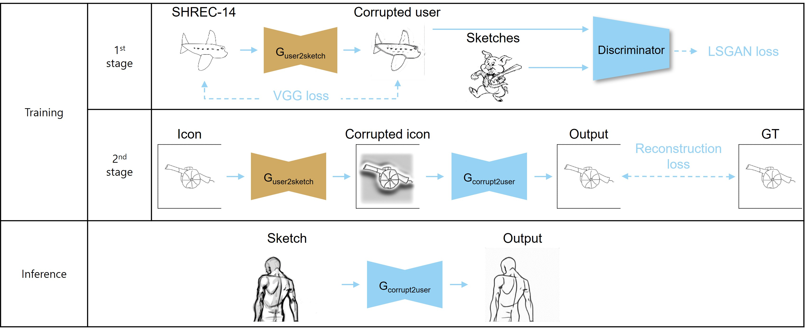
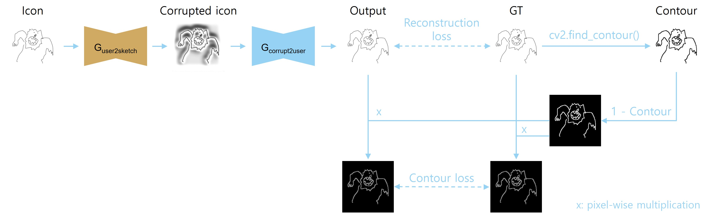

# Simplifying sketches

이 프로젝트는 NC soft 여름 단기 인턴 과제로 수행된 과제입니다.

## Network
---


## Requirements
---

환경 설정을 아래 command 을 통해 할 수 있습니다.

```
docker build -t sketch-simplification .

docker run --gpus all --ipc=host -it -v /home/nahyun/Desktop/sketch/:/model-dir/ sketch-simplification:latest /bin/bash

cd /model-dir/Sketch-simplification
```

**NOTE** 

`docker run` 을 사용할 때 본인의 directory로 변경하여 command 을 입력해야 합니다.

e.g.

`docker run --gpus all --ipc=host -it -v /[yours]/:/[yours]/ sketch-simplification:latest /bin/bash`


## To train the model
---

학습이 완료되면, .pth file 이 ./exp/[exp_name]/[seed_number]/saved_models/ directory 에 저장됩니다.

또한 매 epoch 마다 inference 한 test image 들이 ./exp/[exp_name]/[seed_number]/testimages/[epoch] 폴더에 저장됩니다.

정량적 metric 을 통해 best pth 을 정의하기 어렵기 때문에 매 epoch 마다 pth file 이 [epoch].pth로 저장됩니다.

## The 1st stage

```
sh ./scripts/train1st.sh
```

## The 2nd stage

1st stage 에서 적절한 pth 을 선정하고, --pretrained_root 에 parser 로 입력해주세요.

parser 로 들어온 model 을 활용하여 2nd stage 학습을 진행합니다.

```
sh ./scripts/train2nd.sh
```

## To test the model
---
각 stage 의 pre-trained model 이 ./checkpoints 에 저장되어 있습니다.

pre-trained model 로 inference 한 경우에는 test 결과가 ./checkpoints/[1st or 2nd]/testimages 에 저장됩니다.


## The 1st stage

```
sh ./scripts/test1st.sh
```

## The 2nd stage

test 입력을 1st generator 에 통과시키고 싶으시면 --corrputed_inputs 을 parser 로 넣어주시면 됩니다.

```
sh ./scripts/test2nd.sh
```

## 제안된 contour loss
---




## Directory
---


```
project
│   README.md
│   data_loader.py
│   main.py
│   models.py
│   trainer.py
│   utils.py
│
dataset
│
└───1st-stage
│   │   
│   └───input/SHREC_5900
│   │   │   1.png
│   │   │   ...
│   │   
│   └───target
│   │   └───ImageNet-Sketch
│   │
│   └───test/SHREC14LSSTB_SKETCHES
│       └───airplane
│       └─── ...
│    
└───2nd-stage
│   │
│   └───input/SHREC_5900
│   │   │   1.png
│   │   │   ...
│   │
│   └───GT/SHREC_5900
│   │   │   1.png
│   │   │   ...
│   │
│   └───test
│       └───ImageNet-Sketch
│       └───Rough_sketch_benchmark
│       └───Tracing_vs_Freehand
```

## Reference sites

**Training baseline**

Lee, Gayoung, et al. "Unpaired Sketch-to-Line Translation via Synthesis of Sketches." SIGGRAPH Asia 2019 Technical Briefs. 2019. 45-48.

[Unpaired Sketch-to-Line Translation via Synthesis of Sketches](https://dl.acm.org/doi/abs/10.1145/3355088.3365163?casa_token=U51Pnz8MJP0AAAAA:RE5x7QMkjykNTq-epkR4FNayj6wQE0RtnljIVjjTlP5KFiK3iAWZIk40YPo3yveuMwvdgrQhV1wNvEY)

**Rough sketch domain**

[ImageNet-Sketch](https://github.com/HaohanWang/ImageNet-Sketch)

[Tracing_vs_Freehand](https://github.com/zachzeyuwang/tracing-vs-freehand)

[RoughSketchBenchmark](https://cragl.cs.gmu.edu/sketchbench/)

**User sketch domain**

[SHREC2014](https://www.nist.gov/itl/iad/shrec-2014-datasets)